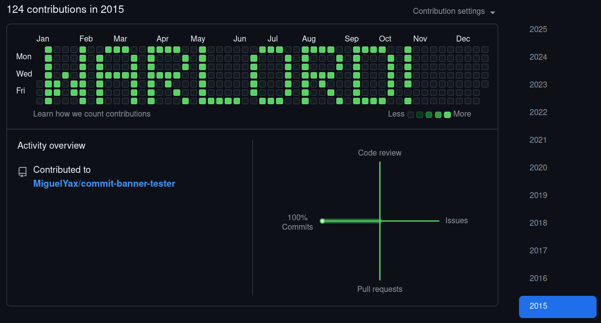
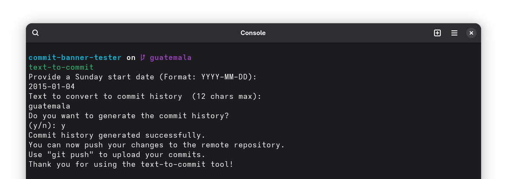
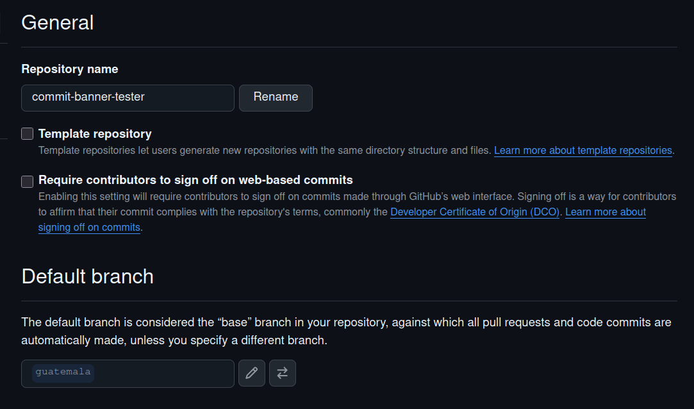
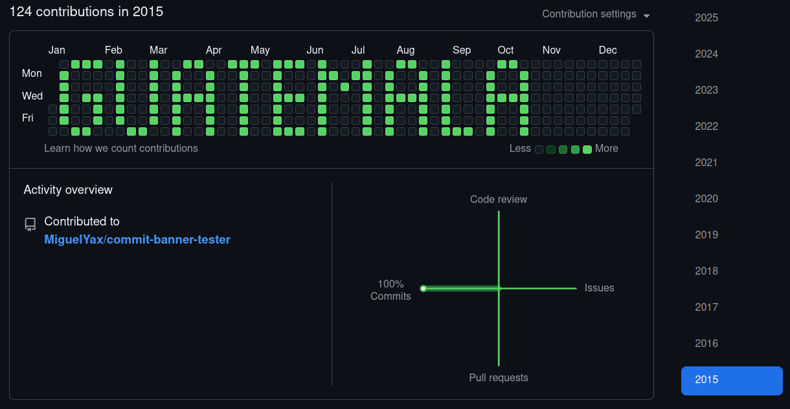

# Text to commit contribution history
Just for Fun - Convert string to a banner using commit contribution history from github.

# Warining!
> This command line tool could add several commits using `git`. Please use It with wisely. I encourage You to create a new repository to try it out!

# Instalation
```sh
npm install -g text-to-commit
```

# Examples




# Getting Started
1. Create an empty repository.
    Repo: [Commit Banner Tester](https://github.com/MiguelYax/commit-banner-tester)
2. Run te command at the target repository
    
3. Push your changes to the remote repository.
   > Note: Commit Contribution history only applies to main branch for each repository.
   - => Tip: You could set your test branch as main by configurin it at repository settings.
   
4. Contribution history example: 
    

# Thank you for using the text-to-commit tool!
